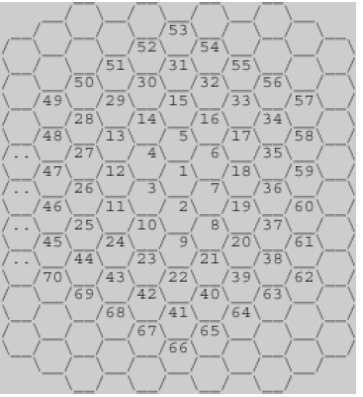

## 문제



위의 그림과 같이 육각형으로 이루어진 벌집이 있다. 그림에서 보는 바와 같이 중앙의 방 1부터 시작해서 이웃하는 방에 돌아가면서 1씩 증가하는 번호를 주소로 매길 수 있다. 숫자 N이 주어졌을 때, 벌집의 중앙 1에서 N번 방까지 최소 개수의 방을 지나서 갈 때 몇 개의 방을 지나가는지(시작과 끝을 포함하여)를 계산하는 프로그램을 작성하시오. 예를 들면, 13까지는 3개, 58까지는 5개를 지난다.

## 입력

첫째 줄에 N(1 ≤ N ≤ 1,000,000,000)이 주어진다.

## 출력

입력으로 주어진 방까지 최소 개수의 방을 지나서 갈 때 몇 개의 방을 지나는지 출력한다.

## 예제 입력 1

```
13
```

## 예제 출력 1

```
3
```

---

## 풀이

벌집의 생성 원리를 보자

1 + $\sum_{k=1}^{n-1} 6k$ 이다.

그래서 M이 주어졌을 때, $1 + 3(n-2)(n-1) < M \leq 1 + 3(n-1)(n)$를 만족하는 n이 최단거리이다.

이를 통해 주어진 N번 방까지 가는데 필요한 최소 이동 횟수를 계산할 수 있다.

```cpp
#include <bits/stdc++.h>
using namespace std;
double N;
int k = 1;
int main(){
    cin >> N;
    while((N-1)/3 > (k) * (k-1)){
        k++;
    }
    cout << k <<"\n";
    return 0;
}
```

---

## 코드 설명

코드는 다음과 같이 동작합니다:

1. N을 입력받습니다.

2. k를 1부터 시작하여 증가시키면서, (N-1)/3이 k\*(k-1)보다 큰 동안 반복합니다.

   - 이는 수학적으로 1 + 3(k-1)(k-2) < N ≤ 1 + 3k(k-1) 조건을 검사하는 것과 같습니다.
   - k는 결과적으로 N번 방까지 가는데 필요한 최소 이동 횟수가 됩니다.

3. 최종적으로 구해진 k를 출력합니다.

예를 들어 N=13인 경우:

- k=1일 때: (13-1)/3 = 4 > 0 (1\*0) → 계속
- k=2일 때: 4 > 2 (2\*1) → 계속
- k=3일 때: 4 ≤ 6 (3\*2) → 종료
  따라서 k=3이 답이 됩니다.

### 시간복잡도

- 시간복잡도는 O(√N)입니다.
- while 루프에서 k가 증가하면서 k\*(k-1)이 (N-1)/3에 도달할 때까지 반복하는데,
- k가 약 √N까지 증가하므로 전체 시간복잡도는 O(√N)이 됩니다.
