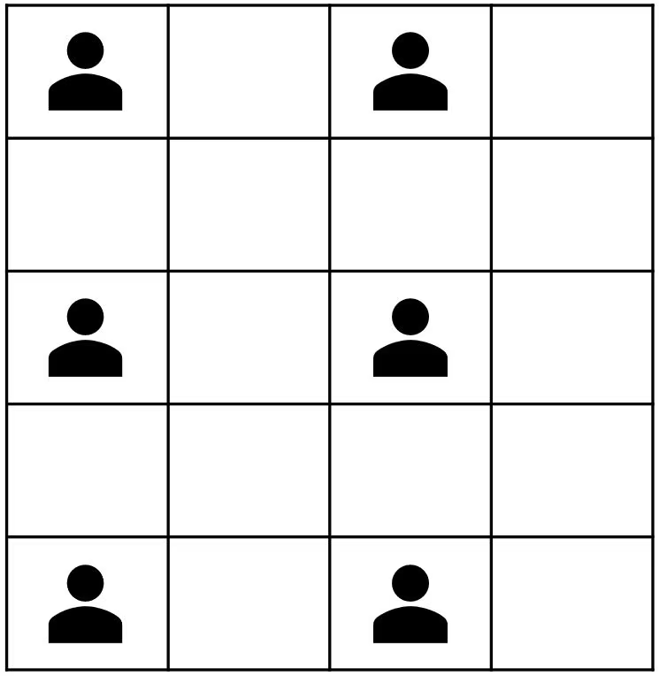

# ZOAC 4

> 시간 제한 메모리 제한 제출 정답 맞힌 사람 정답 비율
>
> 1 초 512 MB 11540 5402 4813 48.489%

## 문제

2021년 12월, 네 번째로 개최된 ZOAC의 오프닝을 맡은 성우는 오프라인 대회를 대비하여 강의실을 예약하려고 한다.

강의실에서 대회를 치르려면 거리두기 수칙을 지켜야 한다!

한 명씩 앉을 수 있는 테이블이 행마다 W개씩 H행에 걸쳐 있을 때, 모든 참가자는 세로로 N칸 또는 가로로 M칸 이상 비우고 앉아야 한다. 즉, 다른 모든 참가자와 세로줄 번호의 차가 N보다 크거나 가로줄 번호의 차가 M보다 큰 곳에만 앉을 수 있다.

논문과 과제에 시달리는 성우를 위해 강의실이 거리두기 수칙을 지키면서 최대 몇 명을 수용할 수 있는지 구해보자.

## 입력

H, W, N, M이 공백으로 구분되어 주어진다. (0 < H, W, N, M ≤ 50,000)

## 출력

강의실이 수용할 수 있는 최대 인원 수를 출력한다.

### 예제 입력 1

5 4 1 1

### 예제 출력 1

6

i행 j열 자리를 (i, j)라고 할 때, (1,1)에 참가자가 앉은 경우 다른 참가자는 (1,2), (2,1), (2,2) 자리를 제외한 나머지 자리에 앉을 수 있다.

(2,2)의 경우는 (1,1)과 행 번호 및 열 번호의 차가 1보다 크지 않으므로 앉을 수 없다.

---

## 배운 점

(25.1.17.금)
타입캐스팅 >> int 형을 double로 변환해야할 때, 예를 들어 분수형을 사용하고 싶다면 분모에 캐스팅을 넣어주는 것이 컨벤션

c++ 에서 ceil 은 올림함수

행렬이 나왔을 때, 각각의 행과 열로 떨어뜨려서 생각하면 좋다.

자료구조를 썼어도 됐다. 따로 공부하고 다시 리뷰하는 걸로
